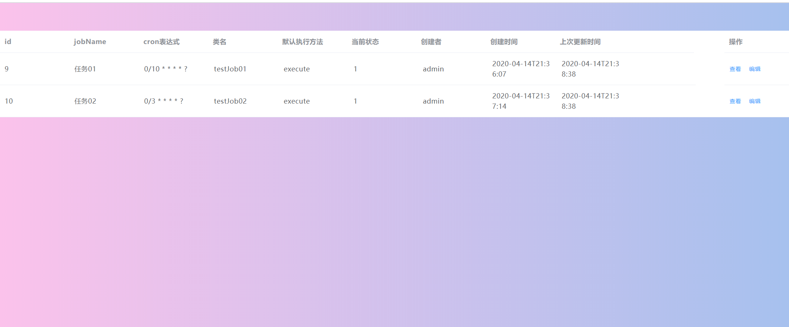

# 定时任务的后台管理页面
- [后台的java地址](https://github.com/Lu-dashuai/jack-email)
- 前后台分离，等待茶姐加入，写前端。
- 参考[elementUI官网](https://element.eleme.cn/#/zh-CN/component/installation)

## 20200415

- 现在差 全部暂停按钮 全部开始按钮 编辑弹框 删除 添加弹框
- 前期不要求分页,样式自己设计，没啥要求，好看点就行
---

1. 编辑弹框：
- 只能修改jobName\  类名\  cron表达式的值。
2. 删除：
- 要求弹出确定删除的框，并且和操作分开写，以免误触。
3. 添加：
- 字段为：jobName\  CronExpression\  beanName